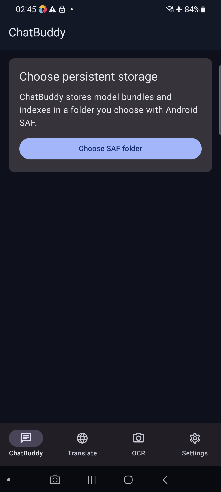
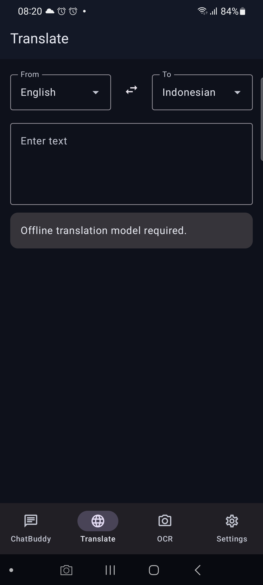
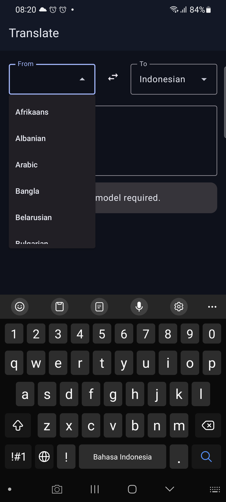

# ChatBuddy

ChatBuddy adalah aplikasi Android local-first untuk chat berbasis dokumen, terjemahan, OCR, persona, dan model AI yang diproses di perangkat. Setelah model diunduh ke folder SAF milik pengguna, jalur inferensi tidak memakai server ChatBuddy.







Preview PNG di atas harus berasal dari APK ChatBuddy yang dijalankan pada device. Jika file belum ada, status preview adalah pending dan bukan bukti fitur AI telah siap.

## Status implementasi

| Area | Status | Batas bukti saat ini |
| --- | --- | --- |
| Compose responsive shell, ModelGate, navigation, persona | Implemented | Unit/UI/device gates dijalankan terpisah |
| Model download action and lifecycle | Implemented | Queued, progress, pause/resume, verifying, retry, and error are rendered inline; large model transfer is user-triggered |
| SAF folder, persistable permission, `.tmp`, Range, checkpoint, checksum, atomic rename | Implemented | Resume/uninstall persistence di device masih perlu sesi model nyata |
| MiniLM INT8 ONNX + WordPiece vocabulary | Implemented | Memerlukan dua artifact SAF yang lolos checksum |
| TXT/PDF/DOCX bounded streaming, chunk 512 dengan overlap 50 | Implemented | Parser berhenti dengan error nyata bila SAF stream rusak atau melewati 200 MB |
| llama.cpp JNI + GGUF dari SAF file descriptor + token Flow | Implemented in build | Inference device memerlukan Gemma artifact 2.84 GB dan belum diklaim tanpa sesi nyata |
| sqlite-vec vector table | Blocked | Extension sqlite-vec belum dipaketkan ke database SQLite Android; RAG retrieval berhenti fail-closed |
| ML Kit translation dan OCR CameraX/gallery | Implemented | Model ML Kit dikelola Play Services, bukan file SAF; device model-pack test pending |
| Whisper partial/final STT | Blocked | Artifact manifest tersedia, JNI Whisper belum dipaketkan |
| Offline TTS | Capability check implemented | Hanya dipakai bila engine Android melaporkan voice offline tersedia |

Tidak ada output AI buatan, fixture yang menyamar sebagai hasil produksi, atau fallback cloud. State yang belum memiliki runtime nyata dikembalikan sebagai `AppResult.Error`/`UNAVAILABLE`.

## Arsitektur

```text
Compose + ViewModel + StateFlow/SharedFlow
                |
        pure Kotlin use cases
                |
 Room / SAF / WorkManager / ML Kit / ONNX Runtime / JNI
```

Package utama mengikuti MVVM dan Clean Architecture:

- `domain/` berisi model, repository contracts, dan use cases tanpa Room/Android.
- `data/` berisi Room, SAF, download worker, ML Kit, embedding, dan repository implementations.
- `ai/` berisi JNI llama.cpp, tokenizer, dan engine boundary yang fail-closed.
- `presentation/` berisi screen state, ViewModel, ModelGate, dan Compose UI.
- `architecture/` berisi traceability dan ADR; `docs/` adalah reference checkout yang sengaja tidak diikutkan Git.

## Model manifest

`app/src/main/assets/model-manifest.json` adalah source of truth artifact. Setiap entry memuat URL yang dipin revision, ukuran, SHA-256, lisensi, ABI, dan storage kind.

- LLM: Gemma 4 E2B IT `Q4_0` resmi dari `ggml-org/gemma-4-E2B-it-GGUF`; link 1B yang tidak tersedia tidak dipakai.
- Embedding: `all-MiniLM-L6-v2` INT8 ARM64 dan `vocab.txt` pada revision yang dipin.
- Voice: Whisper `base-q5_1` pada revision yang dipin; engine JNI masih blocked.

Model tidak disimpan di APK. Pengguna memilih folder melalui SAF, kemudian WorkManager mengunduh ke `ChatBuddyModels/<artifact>.tmp`. Resume memakai HTTP Range dan panjang file SAF yang nyata; file final hanya dibuat setelah ukuran dan SHA-256 cocok.

## Setup lokal

1. Gunakan Android Studio dengan JDK 17, Android SDK 35, NDK `27.0.12077973`, dan CMake `3.22.1`.
2. Jalankan `gradlew.bat :app:testDebugUnitTest`.
3. Jalankan `gradlew.bat :app:lintDebug` dan `gradlew.bat :app:assembleDebug`.
4. Untuk build native, jalankan `gradlew.bat :app:externalNativeBuildDebug`. CMake mengambil llama.cpp pada commit yang dipin di `app/src/main/cpp/CMakeLists.txt`.
5. Install APK ke device, buka ChatBuddy, pilih folder SAF yang dapat ditulis, lalu unduh hanya artifact yang dibutuhkan.

Tidak boleh memasukkan `local.properties`, keystore, token, model binary, atau isi `docs/**` ke commit.

## Offline boundary

Network hanya dipakai untuk setup model dan managed ML Kit model delivery. Prompt, embedding, retrieval, OCR inference, dan LLM generation tidak memiliki client cloud. ML Kit translation tetap diberi label `PLAY_SERVICES_MANAGED`; state itu tidak dijanjikan bertahan setelah uninstall seperti artifact SAF.

## Test evidence

Evidence yang valid ditulis sebagai hasil command/device aktual, bukan angka perkiraan. Gate yang tersedia:

- Pure Kotlin: chunk overlap, persona validation, RAG abstain, download state transition.
- Compose instrumentation: ModelGate unavailable/ready, queued pause action, and inline download state actions.
- Android: lint, Kotlin compile, native ABI build, APK install/launch, dan screenshot preview.
- Pending acceptance: model Gemma nyata, checksum/download resume setelah process kill, sqlite-vec retrieval, Whisper, 200 MB ingestion on device, serta uninstall/reinstall persistence.

Device baseline yang direncanakan: Samsung `SM-G988B`, Android 13 (`RRCN3008VYE`). Hasil device tidak digeneralisasi ke semua handset.

### Evidence captured — 2026-08-19

- `:app:testDebugUnitTest` — pass.
- `:app:lintDebug` — pass; lint menyisakan warning dependency/deprecation, tanpa error.
- `:app:externalNativeBuildDebug` dan `:app:assembleDebug` — pass untuk `arm64-v8a` dan `armeabi-v7a`.
- `:app:connectedDebugAndroidTest` — 5/5 pass pada `SM-G988B - 13`, termasuk editable language dropdown.
- APK terbaru berhasil dipasang dan diluncurkan pada `RRCN3008VYE`; accessibility dump melaporkan package `com.chatbuddy`, tombol SAF, dan empat tab navigasi. Tidak ada `FATAL EXCEPTION` pada smoke log.
- Preview aktual tersedia untuk onboarding, Translate, dropdown bahasa Translate, OCR, Settings, dan landscape. `preview/chatbuddy-device.png` adalah preview utama README.
- `2026-08-20`: layar Translate diverifikasi pada `SM-G988B` dengan exposed autocomplete dropdown `From`/`To`, popup daftar bahasa, keyboard input, tombol swap, dan layout compact portrait; tidak ada chip selector.
- APK debug: 140,153,118 bytes; SHA-256 `e29a5ab3bc63eef31082d38f5882204840390645e4b861d6f7bdb81be24cbe4a`.

Evidence ini membuktikan build, UI shell, navigation, dan launch; tidak membuktikan inferensi atau ingestion tanpa artifact model/runtime yang benar-benar diunduh dan diverifikasi.

### Evidence captured — 2026-08-20

- `:app:compileDebugKotlin` dan `:app:compileDebugAndroidTestKotlin` — pass.
- `:app:testDebugUnitTest`, `:app:lintDebug`, dan `:app:assembleDebug` — pass.
- `:app:connectedDebugAndroidTest` — 5/5 pass pada `SM-G988B - 13`, termasuk callback Download/Pause pada ModelGate dan filtering/selection language dropdown.
- APK debug berhasil dipasang dan cold-launched pada `RRCN3008VYE`; `dumpsys` mengonfirmasi `com.chatbuddy/.MainActivity` sebagai resumed dan smoke log tidak menunjukkan crash aplikasi.
- Transfer Gemma tidak dimulai otomatis selama smoke karena artifact sekitar 2.84 GB; state dan callback diuji tanpa menggunakan bandwidth/storage pengguna secara diam-diam. Sesi transfer nyata tetap membutuhkan tap pengguna, folder SAF, jaringan, checksum, dan ruang penyimpanan yang cukup.
- `2026-08-20` setelah perbaikan download: `"wa"` dipakai untuk SAF append (mode Android `"rwa"` tidak valid), worker failure dipetakan ke status Error yang dapat di-retry, backoff jaringan ditambahkan, dan artifact besar memakai foreground WorkManager.
- Device smoke transfer MiniLM dimulai dari Settings pada `SM-G988B` dan mencapai status `Download scheduled`; completion/SHA-256 `Ready` belum dapat dicatat karena device berpindah ke aplikasi lain selama sesi. Status ini tetap pending, bukan klaim download berhasil.

## License/provenance

Kode aplikasi mengikuti lisensi repository yang dipilih saat release. Artifact model mempertahankan lisensi masing-masing di manifest. llama.cpp dipakai pada commit pin dan lisensinya harus direkonsiliasi sebelum release publik. Reference projects di `docs/**` tidak didistribusikan sebagai source ChatBuddy.
